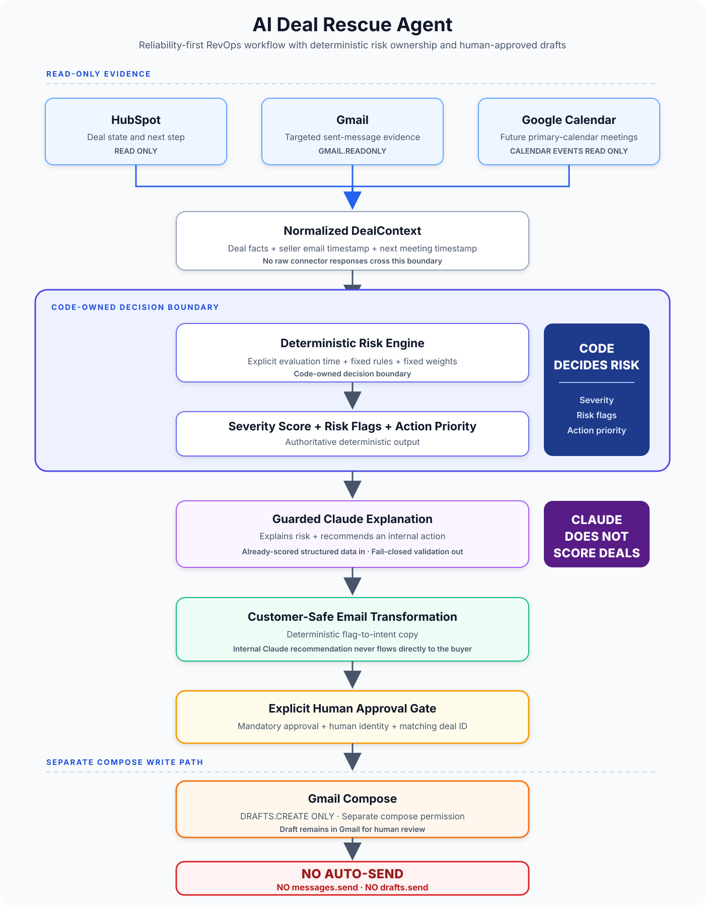
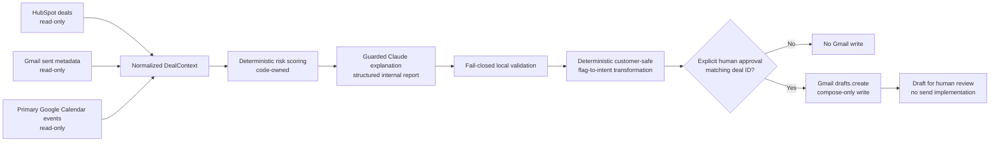

# AI Deal Rescue Agent

**A reliability-first RevOps workflow that identifies quietly deteriorating sales deals from deterministic HubSpot, Gmail, and Google Calendar evidence.**

Sales deals often degrade without one obvious failure event. Follow-ups become stale, meetings disappear, next steps remain blank, and a forecast date approaches while each system still looks superficially normal. AI Deal Rescue Agent combines those signals into one normalized deal context, scores risk in code, and prepares a buyer-safe Gmail draft only after explicit human approval.

This is a portfolio MVP with controlled live acceptance data. It is not presented as a production deployment.

## What It Does

For each controlled deal, the workflow:

1. Reads deal state from HubSpot.
2. Finds the latest sent Gmail message whose subject contains the exact deal marker `[HS-DEAL-<HubSpotDealId>]`.
3. Finds the earliest future, non-cancelled event on the primary Google Calendar with the same exact marker.
4. Normalizes those sources into a `DealContext`.
5. Applies deterministic risk rules and weights.
6. Sends only normalized, already-scored facts to Claude for an internal explanation.
7. Validates Claude's structured output against the authoritative score, flags, deal IDs, and ordering.
8. Converts internal risk categories into deterministic, neutral buyer-facing intent.
9. Requires explicit human approval tied to the same deal ID.
10. Creates a Gmail draft. It never sends the message.

## Architecture



HubSpot, Gmail read-only, and Google Calendar provide evidence; deterministic code owns the risk decision, Claude explains but does not score, and Gmail Compose remains separated behind explicit human approval.



The evidence path is read-only. The only source-system write in the implementation is Gmail `users/me/drafts`. The project contains no Gmail send endpoint.

## Deterministic Risk Model

Risk is calculated by `scoreDeal(context, evaluationTime)`. The evaluation time is supplied explicitly rather than read implicitly from the system clock.

| Flag | Implemented rule | Score contribution |
|---|---|---:|
| `NO_RECENT_SELLER_EMAIL` | No matching seller email exists, or the latest matching email is more than 7 elapsed days old | 0.25 |
| `NO_NEXT_MEETING` | No meeting exists, the meeting is before the evaluation time, or it falls after the deal close timestamp | 0.20 |
| `MISSING_NEXT_STEP` | HubSpot next step is null or whitespace-only | 0.15 |
| `CLOSE_DATE_RISK` | Close date is in the past, or is within 14 UTC calendar days while the deal also lacks a valid next meeting or next step | 0.40 |
| `STALE_DEAL` | Both `NO_RECENT_SELLER_EMAIL` and `NO_NEXT_MEETING` are present | 0.00 |

`STALE_DEAL` is a composite categorical label. It does not add severity beyond its underlying email and meeting conditions. Weighted contributions are summed and capped at `1`.

Closed deals return no flags and severity `0`. The score also reports `daysSinceLastSellerEmail` and UTC-calendar `daysUntilClose` as deterministic diagnostic values.

## Why Claude Is Not the Decision Maker

Claude receives a compact contract containing already-ranked deal IDs, names, authoritative severity scores, flags, timing diagnostics, and evidence-presence booleans. Raw HubSpot, Gmail, and Calendar responses are never included.

The prompt explicitly states that Claude is a reporting and recommendation layer only. It may write an internal summary and recommended action, but it may not:

- Change a deal ID, name, score, risk flag, or deal ordering.
- Add, remove, invent, or reorder flags.
- Choose action priority independently.
- Invent emails, meetings, dates, CRM activity, buyer sentiment, or customer facts.
- Predict that a deal will definitely close or fail.

Claude is forced through a structured tool schema. Its response then passes a local fail-closed validator. The validator rejects malformed JSON/schema, missing or unknown deals, changed ordering, changed scores, changed flags, and inconsistent priority.

Action priority is code-owned:

- Severity `0` maps to `none`.
- Severity greater than `0` and below `0.5` maps to `monitor`.
- Severity `0.5` or greater maps to `intervene`.

## Human-in-the-Loop Safety

Draft creation requires a separate approval object:

```ts
{
  approved: true,
  approvedBy: "human",
  dealId: string
}
```

The client fails unless approval is exactly true, the approver is exactly `human`, and the approval deal ID matches the draft deal ID. Approval cannot be inferred from Claude output, severity, flags, or action priority.

Before an approved write, the draft client validates the deal ID, recipient, subject, plain-text body, size limits, and CR/LF header injection. The client implements only:

```text
POST https://gmail.googleapis.com/gmail/v1/users/me/drafts
```

There is no `drafts.send`, `messages.send`, `/drafts/send`, or `/messages/send` implementation.

## Internal vs Customer-Facing Boundary

Claude's `recommendedAction` is internal operational guidance. It is deliberately not copied into buyer-facing email content.

Instead, a deterministic transformation maps risk categories to limited external intent:

- Missing recent email becomes a polite follow-up.
- Missing meeting becomes a request for a short call.
- Missing next step becomes a request to confirm next steps or decision points.
- Close-date risk becomes neutral timeline alignment without exposing internal forecast dates or risk language.
- `STALE_DEAL` produces no literal customer-facing diagnosis.

Healthy deals with `actionPriority: none` cannot produce a draft candidate.

As defense in depth, the MIME builder rejects internal terms and concepts such as risk scores, severity, stale-deal language, manager intervention, CRM language, close-date risk, recovery actions, deal health, pipeline risk, deterministic flag names, buyer-sentiment claims, and definite close/failure predictions.

Drafts support only `To`, `Subject`, and a plain-text body. There is no CC, BCC, HTML, attachment, threading, recipient discovery, or send behavior.

## Controlled Live Demo

The live acceptance runners use the explicit controlled evaluation timestamp `2026-08-14T12:30:00+05:30`.

| Evidence and outcome | Northstar Analytics - Expansion | Vertex Systems - Platform Upgrade |
|---|---|---|
| Recent seller email | Yes | No |
| Future matching meeting | Yes | No |
| HubSpot next step | Present | Missing |
| Days until close | 32 | 11 |
| Risk flags | None | `NO_RECENT_SELLER_EMAIL`<br>`NO_NEXT_MEETING`<br>`MISSING_NEXT_STEP`<br>`CLOSE_DATE_RISK`<br>`STALE_DEAL` |
| Severity | 0 | 1 |
| Action priority | `none` | `intervene` |
| Draft outcome | No candidate | One explicitly human-approved, customer-safe Gmail draft was verified |
| Automatic email send | No | No |

These are controlled acceptance results, not customer-impact metrics.

## Reliability Engineering

The implementation favors bounded, inspectable behavior:

- **Pagination:** HubSpot deals, Gmail message searches, and Calendar event lists follow their respective next-page tokens.
- **Bounded transient retries:** HubSpot, Gmail, Calendar, and Gmail draft requests retry HTTP 429/5xx responses with finite delay schedules. HubSpot, Calendar, and draft requests safely consume bounded `Retry-After` values when present.
- **Controlled 401 recovery:** Google clients perform at most one access-token refresh and retry after a 401.
- **In-process token reuse:** Valid access tokens and in-flight refreshes are reused during the current Node.js process.
- **Exact scope enforcement:** Every Google client rejects tokens that contain an unexpected or broader scope.
- **Exact evidence matching:** Gmail and Calendar matches require the complete bracketed marker. Similar deal IDs do not match.
- **Calendar filtering:** Queries use the primary calendar, an explicit `timeMin`, expanded recurring events, start-time ordering, pagination, and cancellation filtering.
- **Narrow data reads:** Gmail reads targeted sent-message metadata rather than message bodies. Calendar requests only event ID, summary, status, start, and end fields.
- **Explicit time:** Scoring and Calendar matching receive evaluation timestamps as arguments.
- **Local AI validation:** Claude output is treated as untrusted until it matches the deterministic input contract exactly.
- **Content validation:** Customer-facing subject/body validation runs before OAuth loading or Gmail draft creation.

## OAuth and Permission Separation

Google capabilities use separate tokens with exact least-privilege scopes:

| Capability | Scope | Behavior |
|---|---|---|
| Gmail evidence | `gmail.readonly` | Reads targeted sent-message metadata |
| Calendar evidence | `calendar.events.readonly` | Reads primary-calendar events |
| Gmail draft creation | `gmail.compose` | Creates drafts after human approval |

The evidence clients cannot use the compose token, and the draft client cannot use either read-only token. Normal clients read credentials but never write token files. One-time local desktop OAuth scripts use PKCE, random state, loopback callbacks, offline access, exact returned-scope validation, and non-overwriting token creation.

Credentials, tokens, environment files, keys, dependencies, and build output are excluded from version control.

## Tests

The repository uses Node's built-in test runner and strict TypeScript compilation.

Deterministic coverage includes:

- Risk weights, flag conditions, boundary dates, and closed-deal behavior.
- DealContext normalization and cross-source deal-ID consistency.
- Exact Gmail and Calendar marker matching, similar-ID rejection, ordering, cancellation, and malformed timestamps.
- OAuth token caching, one-401 limits, bounded retries, ordinary 4xx behavior, and pagination with mocked network calls.
- Claude schema acceptance plus fail-closed rejection of changed scores, IDs, flags, order, priorities, and malformed JSON.
- Draft approval rejection, recipient and header validation, MIME payload construction, customer-content filtering, no-action suppression, exact endpoint use, and bounded retry behavior.

Live acceptance scripts separately verify HubSpot, Gmail, Calendar, the complete deterministic risk pipeline, guarded Claude output, and the approval-gated draft path.

```powershell
npm.cmd run typecheck
npm.cmd run build
npm.cmd run test:scoring
npm.cmd run test:gmail
npm.cmd run test:calendar
npm.cmd run test:claude
npm.cmd run test:gmail-draft
```

The following commands use real external APIs and require local configuration:

```powershell
npm.cmd run test:hubspot-live
npm.cmd run test:gmail-live
npm.cmd run test:calendar-live
npm.cmd run test:risk-live
npm.cmd run test:claude-live
```

The draft live runner is write-capable only when explicitly approved. A safe no-write check is:

```powershell
$env:APPROVE_DRAFT_CREATE = "NO"
npm.cmd run test:gmail-draft-live
```

It exits before connector access and reports that no Gmail write was performed.

## Running Locally

Prerequisites:

- Node.js 20 or newer.
- A HubSpot private-app/service credential with read access to deals.
- A Google Cloud desktop OAuth client with the Gmail and Calendar APIs enabled.
- Separate least-privilege OAuth grants for Gmail evidence, Calendar evidence, and Gmail Compose.
- An Anthropic API key for the live explanation path.

Install and validate the deterministic code:

```powershell
npm.cmd install
npm.cmd run typecheck
npm.cmd run build
npm.cmd run test:scoring
npm.cmd run test:gmail
npm.cmd run test:calendar
npm.cmd run test:claude
npm.cmd run test:gmail-draft
```

Store all credentials and generated tokens only in the locally ignored credential area expected by the clients. Never commit credential files, OAuth authorization codes, access tokens, refresh tokens, private keys, or `.env` files.

The repository includes one-time local OAuth helpers:

```powershell
npm.cmd run auth:gmail-revops
npm.cmd run auth:calendar-revops
npm.cmd run auth:gmail-compose-revops
```

Review each requested scope before consenting. The helpers refuse broader returned scopes and refuse to overwrite an existing destination token.

For Claude live validation, provide `ANTHROPIC_API_KEY`; `ANTHROPIC_MODEL` is optional. Do not place either value in source control.

The controlled draft live test additionally requires a developer-owned recipient in `DRAFT_TEST_TO`. It creates a draft only when `APPROVE_DRAFT_CREATE` is exactly `YES`. Review the resulting draft manually. The project never sends it.

## Current MVP Limitations

- Live orchestration is intentionally restricted to the two controlled demo deals rather than iterating a production pipeline.
- Acceptance runners use a historical explicit evaluation timestamp for reproducibility.
- Gmail matching depends on exact `[HS-DEAL-<id>]` subject markers in sent mail.
- Calendar evidence is limited to the primary calendar; all-day dates are normalized as UTC midnight.
- Recipient discovery is not implemented. The controlled draft recipient is supplied manually through `DRAFT_TEST_TO`.
- Evidence retrieval is sequential per controlled deal.
- There is no production scheduler, queue, service, deployment configuration, monitoring, or approval UI.
- Claude request failures fail closed, but the Claude request itself has no transient retry policy.
- Retrying a non-idempotent draft creation after an ambiguous 5xx response could theoretically create a duplicate draft. It still cannot send email.
- Customer-content filtering is defensive and heuristic; deterministic flag-to-intent generation is the primary boundary.
- There is no autonomous Gmail send and no HubSpot or Calendar write path.

## Future Extensions

Potential next steps, not currently implemented:

- Iterate over configurable production deal cohorts instead of controlled fixtures.
- Add a Slack or manager approval interface with auditable approval records.
- Associate CRM contacts to recipient addresses through an explicitly reviewed policy.
- Make risk thresholds and weights configurable while retaining deterministic evaluation.
- Add dashboards for evidence freshness, risk distribution, and approval outcomes.
- Add deployment, scheduling, observability, and operational alerting.
- Add idempotency protection and reconciliation for draft creation retries.

## Tech Stack

- Node.js 20+
- TypeScript with strict compiler settings
- Node built-in `fetch`, HTTP, crypto, filesystem, and test modules
- HubSpot CRM REST API
- Gmail API
- Google Calendar API v3
- Google OAuth 2.0 desktop loopback flow with PKCE
- Anthropic Messages API with forced structured tool output
- PowerShell-compatible npm workflows

The project intentionally has no runtime npm dependencies. TypeScript and Node type definitions are development dependencies.
